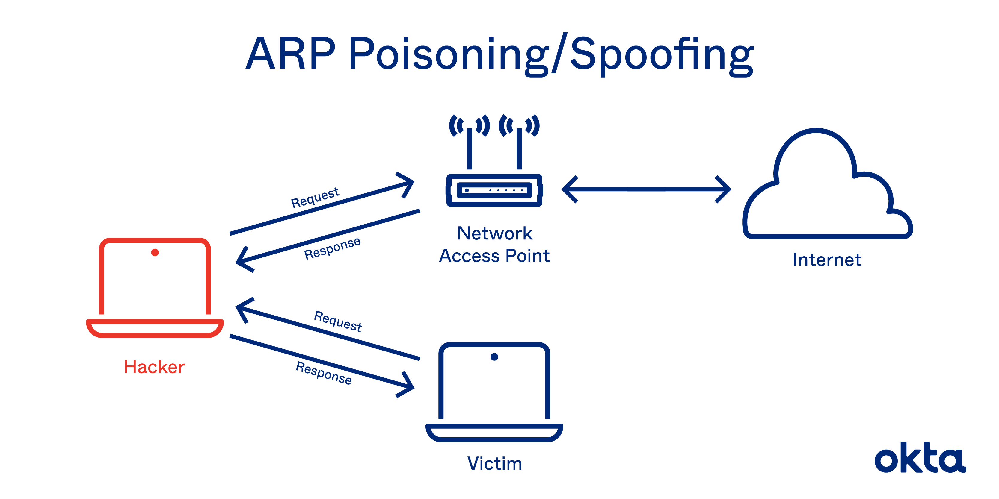

# Man In The Mıddle Attack -- ARP POISONING ( English )

## Introduction :
- Man In The Middle Attack implies an active attack where the attacker/Hacker creates a connection between the victims and sends messages between them or may capture all the data packets from the victims. In this case, the victims think that they are communicating with each other, but in reality, the malicious attacker/hacker controls the communication i.e. a third person exists to control and monitor the traffic of communication between the two parties i.e. Client and Server.

###  Types of Man In The Middle Attack :
 * Here, we will discuss the types of Man In The Middle Attack as follows.

#### ARP Spoofing :
ARP Stands for Address Resolution Protocol. This protocol is used for resolving IP addresses to machine MAC addresses. All the devices which want to communicate in the network, broadcast ARP-queries in the system to find out the MAC addresses of other machines.  ARP Spoofing is also known as ARP Poisoning. In this, ARP poisoning, ARP packets are forced to send data to the attacker’s machine. ARP Spoofing constructs a huge number of forced ARP requests and replies packets to overload the switch. The intention of the attacker all the network packets and switch set in forwarding mode. 
 
#### DNS Spoofing :
Similar to ARP, DNS resolves domain names to IP addresses. DNS spoofing is very dangerous because in this case a hacker will be able to hijack and spoof any DNS request made by the user and can serve the user fake web pages, fake websites, fake login pages, fake updates, and so on.

------

### Man In The Middle Attack Techniques :

1. Packet Sniffing
2. Session Hijacking
3. SSL stripping
4. Packet Injection

#### Man in Middle Attack using ARP spoofing : 

##### `Step-1 :`
 >  ARP spoofing -It allows us to redirect the flow of packets in a computer network. 
    Example of a typical Network as follows.

