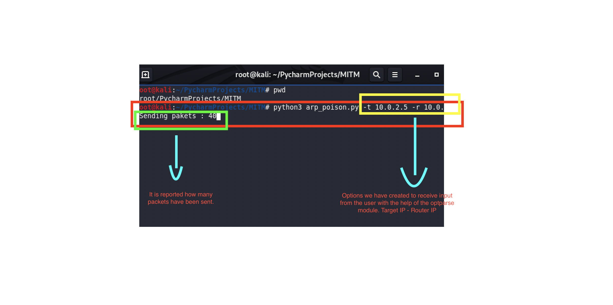

# Man In The Mıddle Attack -- ARP POISONING ( English )


# Introduction :
- Man In The Middle Attack implies an active attack where the attacker/Hacker creates a connection between the victims and sends messages between them or may capture all the data packets from the victims. In this case, the victims think that they are communicating with each other, but in reality, the malicious attacker/hacker controls the communication i.e. a third person exists to control and monitor the traffic of communication between the two parties i.e. Client and Server.

###  Types of Man In The Middle Attack :
 * Here, we will discuss the types of Man In The Middle Attack as follows.

#### ARP Spoofing :
ARP Stands for Address Resolution Protocol. This protocol is used for resolving IP addresses to machine MAC addresses. All the devices which want to communicate in the network, broadcast ARP-queries in the system to find out the MAC addresses of other machines.  ARP Spoofing is also known as ARP Poisoning. In this, ARP poisoning, ARP packets are forced to send data to the attacker’s machine. ARP Spoofing constructs a huge number of forced ARP requests and replies packets to overload the switch. The intention of the attacker all the network packets and switch set in forwarding mode. 
 
#### DNS Spoofing :
Similar to ARP, DNS resolves domain names to IP addresses. DNS spoofing is very dangerous because in this case a hacker will be able to hijack and spoof any DNS request made by the user and can serve the user fake web pages, fake websites, fake login pages, fake updates, and so on.

------

### Man In The Middle Attack Techniques :

1. Packet Sniffing
2. Session Hijacking
3. SSL stripping
4. Packet Injection


#### Man in Middle Attack using ARP spoofing : 

##### ` Example of a typical Network as follows :`
 >  ARP spoofing -It allows us to redirect the flow of packets in a computer network. 


---

## How to do an ARP Spoof/Poisoning Attack :
* We can do an ARP Spoof attack using the built-in tool called ARPSPOOF in Kali Linux, or we can also create an ARP Spoof attack using  python language.

### Execution steps :
##### `Step-1 :`
* We can run the built-in “ARPSPOOF’” tool in Kali Linux. In case the ARPSPOOF tool is not present, you can install the tool by running the following command as follows.

```console
apt install dsniff

```
* Or you can write an ARP Poisoning tool yourself with the Python programming language, or you can download the ARP Poisoning tool I wrote from your terminal to your computer.

```console
git clone https://github.com/TarikKaanKoc/MITM.git

```

##### `Step-2 :`
* Run the following command to enable port forwarding before performing the MITM attack.
* If you do not run the following command in the terminal, the internet connection of the target computer may be lost when you start the attack. In this case, the target computer user may notice that an attack has occurred, and this is a situation we do not want to happen.
* This command will again establish the Internet connectivity of the victim computer. In this way, we can become the Man-In-The-Middle by using the ARP Spoof attack. So all the requests from the victim’s computer will not directly go to the router it will flow through the from our machine 
```console
echo 1 > /proc/sys/net/ipv4/ip_forward 
```
##### `Step-3:`
> I will explain the third stage through the ARP-Poisoning tool I wrote.
* First we need two things to perform the attack, the IP address of the victim machine and the IP address of the Gateway. In this example, we use a Windows Machine as our victim and a Kali Machine to execute the attack.

```console
arp -a
```
* Output:
This will show us the following Outputs as follows.
Victim Machine (Windows Machine) –


* Or you can use our Net Scanner Tool instead of this method.

### <a href="https://github.com/TarikKaanKoc/Net-Scanner-Tool">Click</a> for NET-SCANNER Tool.

##### `Step-4:`

* To perform the attack, we run the tool I wrote in python programming language from the terminal and enter the ip address and gateway of the victim machine we obtained in step 3 with the command to run.
> With the -t command, we enter the IP address of the target computer here. 

> With the -r command, we enter the IP address of the router here


#### `When you examine our source codes, you can understand why we entered it this way :` 

```console
optparse_object.add_option("-r", "--router", dest="router_ip", help="Enter router ip address")
```
```console
optparse_object.add_option("-r", "--router", dest="router_ip", help="Enter router ip address")
```


## Tested On 

 Sr. | Operating System | Version | Virtual Box | VM Ware | Network Type |
--- | --- | --- | --- | --- | --- |
1 |  Kali Linux</img> | 2021.2 | | | |
2 |  Kali Linux</img > | 2021.1 |  |  |   |
3 |  Kali Linux</img > | 2020.4 | | | |
4 |  Kali Linux</img > | 2019.4 | | |  |
5 |  Kali Linux</img > | 2018.4 | | |  |

---
